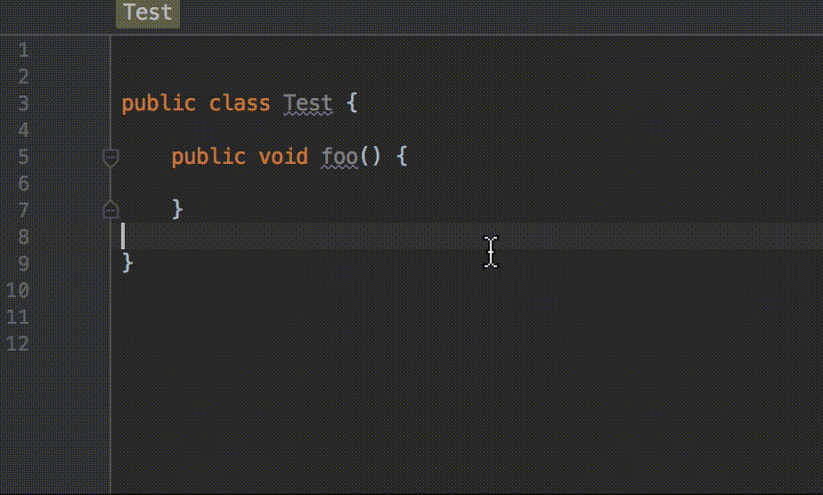

# Here Be Dragons
Here be dragons is an Intellij/Android Studio plugin that let's you annotate your impure Java methods with the `@SideEffect` annotation and shows a little dragon icon in the gutter when you call them.



# Why would I want to do this?
When writing functional style code, isolating impure and pure functions becomes very important. This helsp you visually identify which methods are impure when a bunch of methods are being called in a code block.

For a beginner friendly introduction to functional programming in Android, please checkout out my [blog series](https://medium.freecodecamp.com/functional-programming-for-android-developers-part-1-a58d40d6e742#.z2eewm52o).

# Download
[Download](https://github.com/anupcowkur/here-be-dragons/blob/master/here-be-dragons-1.0.0.jar?raw=true) the plugin jar and select "Install Plugin From Disk" in IntelliJ's plugin preferences.

Add the jcenter repository to your gradle build file if it's not already present:

```groovy
repositories {
    jcenter()
}
```

Next, add the lib containing the `@SideEffect` annotation as a dependency:

```groovy
dependencies {
    compileOnly 'com.anupcowkur:here-be-dragons-annotation:1.0.0'
}
```

Note that we only need the dependency during compile time so we mark it`compileOnly`.

# Usage
Simpy add the `@SideEffect` annotation to any method you want like this:

```java
import com.anupcowkur.herebedragons.SideEffect;

public class Test {
    @SideEffect
    public void foo() {
        // do some impure things
    }
}
```

And when you call the method anywhere, you'll see the dragon icon show up in the IDE gutter.

# License
This project is licensed under the [MIT License](https://github.com/anupcowkur/here-be-dragons/blob/master/License.txt)

